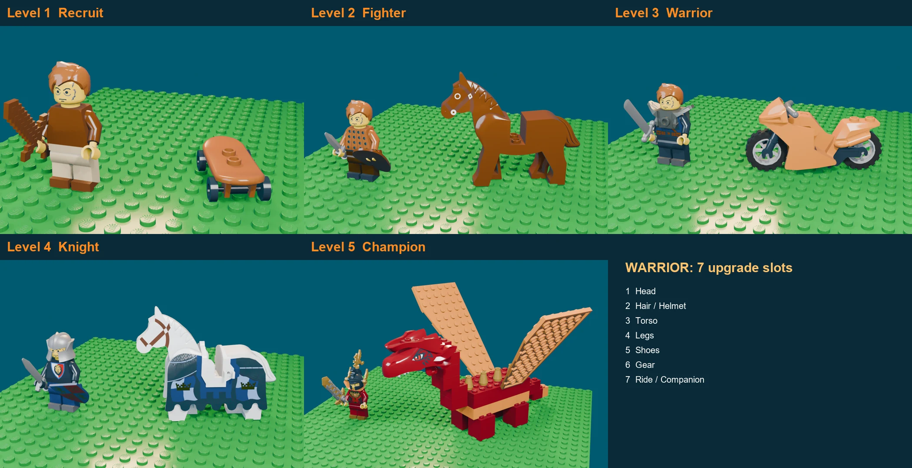

# Lego 3D assets

Everything in the Lego world (characters, their upgrades, rides, and later houses, gardens and the town) is built from **real Lego parts** (the LDraw library), described as data and turned into 3D with scripts. Nothing here is hand-modelled, so any item is a one-line edit.



## The 7 upgrade slots

Every character has the same 7 slots (`catalog/slots.json`). Each slot holds one item, unlocked by level and bought with coins.

| # | Slot | What it is |
|---|---|---|
| 1 | Head | Face print (expression, scars, war paint) |
| 2 | Hair / Helmet | Hairpiece, hat, helmet or crown |
| 3 | Torso | Printed torso with arms and hands (clothes, armor) |
| 4 | Legs | Hips and legs |
| 5 | Shoes | Colour/material of the feet. Lego has no separate shoes, so the script paints the foot area of the legs |
| 6 | Gear | Right-hand weapon, left-hand shield/tool, neck piece (shoulder armor or cape) |
| 7 | Ride / Companion | Vehicle or creature next to the character (skateboard up to dragon, later spaceship / jet) |

## The Warrior, levels 1 to 5 (the example set)

| Level | Title | Outfit | Weapon | Ride |
|---|---|---|---|---|
| 1 | Recruit | Brown tunic, brown boots | Wooden training sword | Skateboard |
| 2 | Fighter | Studded armor, black boots | Gladius + round shield | Brown horse |
| 3 | Warrior | Viking armor, shoulder armor, iron boots | Greatsword | Racing motorcycle |
| 4 | Knight | Knight helmet, lion armor, steel boots | Longsword + royal lion shield | White horse in royal armor |
| 5 | Champion | Gold dragon-crown helmet, red and gold armor, gold boots | Gold-inlay sword | Brick-built dragon |

## Folder layout

```
3d/lego/
  catalog/slots.json              the 7 slots + LDraw colour names -> codes
  characters/<name>/levels.json   one loadout per level (slot -> part + colour)   <- edit this
  rides/*.ldr                     rides / companions (dragon.ldr is generated by tools/build_dragon.py)
  ldr/                            generated minifig builds, one per level (do not edit by hand)
  glb/                            generated 3D files for the web app (Draco compressed)
  renders/                        preview images (.webp in git, full .png stays local)
  tools/
    build_ldr.py                  levels.json -> ldr/<name>_L<n>.ldr
    build_dragon.py               writes rides/dragon.ldr
    blender_levels.py             Blender logic: import, place, paint shoes, render, export
    render_cli.py                 one level, headless: render + .glb
    make_sheet.py                 comparison sheet of all levels
    make_catalog.py               searchable index of all 24k LDraw parts
```

## One-time setup

1. **Blender 5.1**.
2. **LDraw parts library**: download `complete.zip` from https://library.ldraw.org/library/updates/complete.zip and unzip it so you have `~/ldraw/parts`. (Other location: set `SL_LDRAW_DIR`.)
3. **ldr_tools_blender add-on 0.5.1** (Blender 5.1 build): https://github.com/ScanMountGoat/ldr_tools_blender/releases , install the zip in Blender (Edit > Preferences > Add-ons > Install from disk) and enable it.
4. Python with Pillow for the sheet (`pip install pillow`).
5. Optional: `python tools/make_catalog.py` builds `catalog/ldraw_catalog.tsv` so you can grep parts by name.

## Workflow

```bash
cd 3d/lego/tools
# 1. edit ../characters/warrior/levels.json
python build_ldr.py ../characters/warrior/levels.json ../ldr
# 2. render + export ONE level per run (keeps the PC light; a full batch in the open Blender window crashed a PC)
blender -b --python render_cli.py -- warrior 5
# 3. refresh the comparison sheet
python make_sheet.py warrior
```

### Finding parts

`grep -i "Minifig Helmet" ../catalog/ldraw_catalog.tsv`. Colours use the names in `catalog/slots.json` (add more from `ldraw/LDConfig.ldr`).

### LDraw coordinates (for new builds)

LDraw units: 20 LDU = 1 stud, 24 LDU = 1 brick high, **-Y is up**, front is -Z. The importer scales by 0.01 and converts to Blender Z-up (front = -Y).
Minifig anchor points used by `build_ldr.py`: head and hair at y = -24, torso at 0, hips+legs at y = 32, held items at the hand grip (see `GRIP_R` / `GRIP_L`).

## Using the .glb files in the app

The `.glb` files are Draco compressed. In three.js, load them with `GLTFLoader` plus `DRACOLoader`:

```ts
const draco = new DRACOLoader();
draco.setDecoderPath("https://www.gstatic.com/draco/versioned/decoders/1.5.7/");
const loader = new GLTFLoader().setDRACOLoader(draco);
loader.load("/lego/warrior_L5.glb", (gltf) => scene.add(gltf.scene));
```

Each .glb holds the character and the ride of that level (no display plate). They are not in `public/` yet; copy the ones the app uses there when the 3D view is wired in.

## Next

- The other 4 characters (Mentalist, Wizard, Guardian, Shadow) as `characters/<name>/levels.json`.
- House, garden and town pieces with the same approach (data file -> ldr -> Blender -> glb), matching the town/house logic on `ifti/world-prototype`.
- Modelling polish: the dragon and higher-tier rides (spaceship, jet) still need work.
